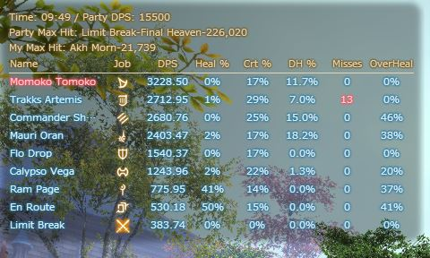
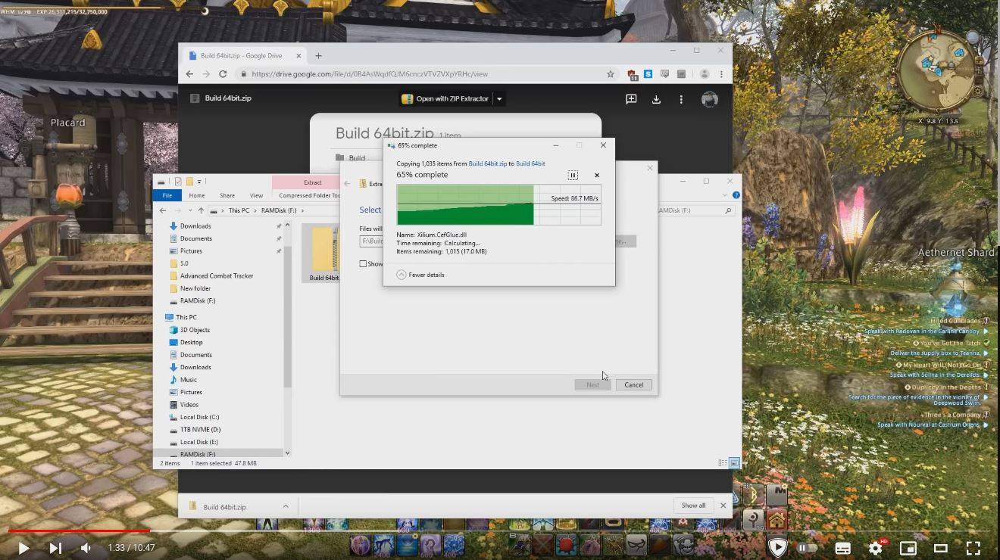

# FFXIV Rainbowmage Overlay Plugin

  
## Description
These are my ACT overlay skins to be used with ACT and the Rainbowmage Overlay Plugin.

Note: this repo contains the entire 0.3.3.13 Rainbowmage Build. This build is more light-weight than the default installer through the ACT plugin manager, which contains a bit too much bloat for my use case.

## Setup

Youtube Tutorial:

1. Download and configure [Advanced Combat Tracker](https://advancedcombattracker.com/download.php)
2. Select FFXIV parsing plugin after installation.
3. Download the zip file containing the Build folder. This can be done through Github using the green Code dropdown menu, then selecting [Download Zip](https://github.com/momokotomoko/ffxivRainbowmageOverlay/archive/refs/heads/master.zip). Alternatively, I have a google drive link [here](https://drive.google.com/file/d/0B4AsWqdfQJM6cnczVTVZVXpYRHc/view?usp=drive_link&resourcekey=0-Zew2FwuggNAGPfGmn-pelQ) **IMPORTANT** DO NOT UNZIP YET, STEP 4 IS REQUIRED BEFORE UNZIP!
4. Right click the zip file, go into Properties, and Unblock and click Apply.
5. Double check the Unblock applied correctly by re-doing the Right click -> Properties. If the Unblock option no longer exists, then the previous step was successful.
6. Extract the 'Build' folder from the zip file into your ACT installation directory (ie: `C:\Program Files (x86)\Advanced Combat Tracker`)
7. In ACT, go into the Plugins tab -> Plugin Listing tab -> Browse, and select the `OverlayPlugin.dll` file in the Build folder. Then click Add/Enable Plugin

## Fonts

This overlay looks best with the Meiryo font. I have included the font file in this repo as [`meiryo.ttc`](meiryo.ttc).

To install the font, simply download it, place it in the `C:\Windows\Fonts` folder, and double click it to install the font.

